# 🚀 CI/CD Setup Guide

## Overview

This project uses GitHub Actions for Continuous Integration and Continuous Deployment (CI/CD).

## Workflows

### 1. Deploy to GitHub Pages (`deploy.yml`)

**Triggers:**
- Push to `main` branch
- Manual trigger via GitHub Actions UI

**What it does:**
1. ✅ Checks out code
2. ⚡ Sets up Bun runtime
3. 📦 Installs dependencies
4. 🧪 Runs all tests
5. 🏗️ Builds production bundle
6. 🚀 Deploys to GitHub Pages

**Environment:** `github-pages`

### 2. Run Tests (`test.yml`)

**Triggers:**
- Push to any branch except `main`
- Pull requests to `main` branch

**What it does:**
1. ✅ Checks out code
2. ⚡ Sets up Bun runtime
3. 📦 Installs dependencies
4. 🧪 Runs all tests
5. 🏗️ Verifies build works

**Purpose:** Ensures code quality before merging

## Setup Instructions

### First Time Setup

1. **Configure GitHub Pages in your repository:**
   - Go to repository Settings → Pages
   - Source: Deploy from a branch OR GitHub Actions (recommended)
   - If using "Deploy from a branch", select `gh-pages` branch

2. **Set up repository permissions:**
   - The workflows are already configured with correct permissions
   - No additional secrets needed!

3. **Commit and push the workflows:**
   ```bash
   git add .github/workflows/
   git add bun.lockb  # Important for reproducible builds!
   git commit -m "Add CI/CD workflows"
   git push origin main
   ```

### Switching to GitHub Actions Deployment (Recommended)

For better control and faster deployments:

1. Go to **Settings → Pages**
2. Under "Build and deployment" → Source
3. Select **"GitHub Actions"**
4. That's it! Next push to main will automatically deploy

### Alternative: Keep using gh-pages branch

If you prefer the old method with `gh-pages` branch:

1. Update `deploy.yml` to use `gh-pages` deployment action
2. Or use the manual deploy command: `bun run deploy`

## How It Works

### On Every Push to Main:

```mermaid
graph LR
    A[Push to main] --> B[Checkout Code]
    B --> C[Setup Bun]
    C --> D[Install Dependencies]
    D --> E[Run Tests]
    E --> F{Tests Pass?}
    F -->|Yes| G[Build]
    F -->|No| H[❌ Fail]
    G --> I{Build Success?}
    I -->|Yes| J[Deploy to Pages]
    I -->|No| H
    J --> K[✅ Live!]
```



### On Pull Requests:

```mermaid
graph LR
    A[Open PR] --> B[Checkout Code]
    B --> C[Setup Bun]
    C --> D[Install Dependencies]
    D --> E[Run Tests]
    E --> F{Tests Pass?}
    F -->|Yes| G[Test Build]
    F -->|No| H[❌ Fail PR Check]
    G --> I{Build Success?}
    I -->|Yes| J[✅ Pass PR Check]
    I -->|No| H
```



## Monitoring Deployments

### View Workflow Runs

1. Go to your repository on GitHub
2. Click the **"Actions"** tab
3. See all workflow runs and their status

### Check Deployment Status

- Green checkmark ✅ = Successful deployment
- Red X ❌ = Failed (click for logs)
- Yellow circle 🟡 = In progress

### View Logs

Click on any workflow run → Click on job → Expand steps to see detailed logs

## Manual Deployment

If you need to deploy manually:

### Option 1: Trigger GitHub Action
1. Go to Actions tab
2. Select "Deploy to GitHub Pages"
3. Click "Run workflow" → Select branch → Run

### Option 2: Command Line (Legacy)
```bash
bun run deploy
```
*Note: This uses gh-pages package, not GitHub Actions*

## Troubleshooting

### Deployment Fails

**Check 1: Build locally**
```bash
bun run build
```
If this fails, fix the errors first.

**Check 2: Test locally**
```bash
bun test
```
All tests must pass before deployment.

**Check 3: Permissions**
- Go to Settings → Actions → General
- Ensure "Read and write permissions" is enabled
- Or use the new Pages deployment method (recommended)

### Tests Fail in CI but Pass Locally

**Common causes:**
1. Missing `bun.lockb` file
   ```bash
   # Make sure it's committed
   git add bun.lockb
   git commit -m "Add lockfile"
   ```

2. Environment differences
   - Check Node.js/Bun version differences
   - Review test output in GitHub Actions logs

### Page Not Loading

**Check 1: Base URL**
Verify `vite.config.js` has correct base:
```javascript
export default defineConfig({
  base: '/Othello/',  // Must match repo name!
  // ...
});
```

**Check 2: GitHub Pages Settings**
- Ensure Pages is enabled
- Check the deployment URL
- Wait 1-2 minutes after deployment

### Cannot Find Module Errors

Make sure all imports use `.js` extension:
```javascript
// ✅ Correct
import { something } from './module.js';

// ❌ Wrong (might work locally but fail in CI)
import { something } from './module';
```

## Best Practices

### ✅ Do's

1. **Always commit `bun.lockb`**
   - Ensures reproducible builds
   - Faster CI installs

2. **Test locally before pushing**
   ```bash
   bun test && bun run build
   ```

3. **Use meaningful commit messages**
   - Helps track what broke if deployment fails

4. **Review failed workflow logs**
   - Detailed error messages help debug

5. **Keep workflows updated**
   - Use latest action versions
   - Update Bun version periodically

### ❌ Don'ts

1. **Don't commit `node_modules/`** or `dist/`
   - Already in `.gitignore`

2. **Don't skip tests locally**
   - CI will fail anyway

3. **Don't ignore lockfile conflicts**
   - Resolve them properly: `bun install`

4. **Don't modify workflow files without testing**
   - Use workflow dispatch to test changes

## Performance

### Typical CI/CD Times

- **Install dependencies**: ~5-10 seconds
- **Run tests**: ~1-2 seconds (28 tests)
- **Build**: ~3-5 seconds
- **Deploy**: ~10-20 seconds
- **Total**: ~30-40 seconds from push to live! 🚀

Compare to traditional setups:
- npm install: 30-60 seconds
- Jest tests: 10-30 seconds
- webpack build: 20-40 seconds
- **Old total**: 60-130 seconds

**You're saving 50-100 seconds per deployment!** ⚡

## Status Badges

Add these to your README.md:

```markdown


```

Result:
- 
- 

## Advanced Configuration

### Deploy to Custom Domain

1. Add `CNAME` file to `public/`:
   ```
   yourdomain.com
   ```

2. Configure DNS:
   - Add A records to GitHub IPs
   - Or CNAME to `cozygarage.github.io`

3. Update Settings → Pages → Custom domain

### Deploy Previews for PRs

See `.github/workflows/test.yml` - already configured!

### Notifications

Add Slack/Discord notifications:
```yaml
- name: Notify on failure
  if: failure()
  uses: 8398a7/action-slack@v3
  with:
    status: ${{ job.status }}
    webhook_url: ${{ secrets.SLACK_WEBHOOK }}
```

## Security

### No Secrets Needed!

This setup uses GitHub's built-in tokens:
- `GITHUB_TOKEN` - Auto-provided
- `pages: write` permission - Set in workflow

### Keep Dependencies Updated

Dependabot is your friend:
```yaml
# .github/dependabot.yml
version: 2
updates:
  - package-ecosystem: "npm"
    directory: "/"
    schedule:
      interval: "weekly"
```

## Cost

**FREE!** 🎉
- GitHub Actions: 2,000 minutes/month (free tier)
- GitHub Pages: Free for public repositories
- This setup uses ~1 minute per deployment

## Support

- 📖 [GitHub Actions Docs](https://docs.github.com/en/actions)
- 📖 [GitHub Pages Docs](https://docs.github.com/en/pages)
- 🐛 [Report Issues](https://github.com/cozyGarage/Othello/issues)

---

**Your project now has professional-grade CI/CD! 🚀**
